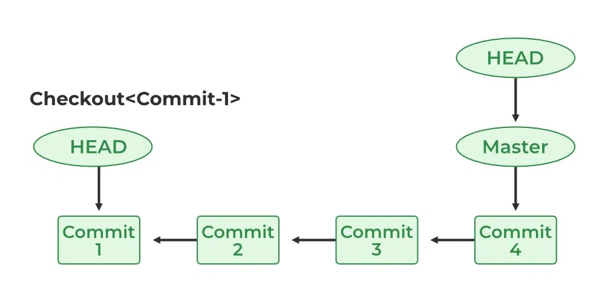

# Introduction to Git and GitHub

<p align="center">
  
  
  <h2 align="center">A beginner friendly guide to Git</h1>
</p>

As Computer Science and Engineering (CSE) graduates, we often find ourselves:

* **Creating and managing various projects:** From simple scripts to complex applications, the projects can range widely in scope and complexity.
* **Handling large projects with numerous files and directories:** It's like trying to organize a digital closet where every item has its place, but sometimes things get a bit messy.
* **Facing challenges in managing and tracking changes:** Keeping track of what changed, when, and why can quickly become a daunting task without the right tools.

**Solution:** Enter **Git** and **GitHub**—your trusty sidekicks in the epic saga of project management and version control. These tools help you keep your projects organized, track changes seamlessly, and collaborate with others without the chaos.

## What is Git and GitHub?

**Git:**

* **Distributed Version-Control System:** Think of Git as a super-efficient librarian who keeps track of every change made to your project's files.
* **Tracks changes in source code during development:** Whether you're tweaking a single line or overhauling an entire module, Git remembers it all.
* **Coordinates work among programmers:** Collaborate without stepping on each other's toes.
* **Can track changes in any set of files:** Not just code—documents, images, you name it.

**GitHub:**

* **Web-based Git Repository Hosting Service:** Imagine GitHub as the online home where your Git repositories live and breathe.
* **Offers Git functionalities:** All the power of Git, with the convenience of the cloud.
* **Adds collaboration features:** Pull requests, issues, and wikis to make teamwork a breeze.

**In Layman's Terms:**

* **Git:** A tool to track changes in your project files, ensuring you never lose your way. A **time machine for your code,** if you will.
* **GitHub:** A platform to store your project files online, making it easy to collaborate with others and showcase your work to the world.

## Why Use Git and GitHub?

* **Experiment Safely:**
  * Initialize a Git repository in your project folder—think of it as setting up a sandbox for your project.
  * Create checkpoints (`commits`) to save the project's state at various points, allowing you to revert back if something goes south.

* **Manage Changes:**
  * If you break something (hey, it happens), you can effortlessly go back to the last stable commit and start fresh.
  * Create `branches` for different project versions or features, keeping your main project pristine.

* **Collaboration:**
  * Merge branches when features are ready to join the main project.
  * If a feature doesn't pan out, simply delete the branch without any mess.

## Difference Between Git and GitHub

* **Solo Projects:**
  * Manage files locally with Git—your projects stay on your machine, safe and sound.

* **Collaborative Projects:**
  * Use GitHub as cloud storage for your project files—share the love (and your code) with others.
  * Enable multiple collaborators to:
    * Push changes to GitHub
    * Pull changes from GitHub
    * Create and merge branches seamlessly

**Summary:**
Git is your local project manager, keeping everything tidy on your computer. GitHub, on the other hand, is the social platform where you can share, collaborate, and manage your projects with others, all while leveraging Git's powerful version control features.

**Note:** In this lesson, we focus on the basics of **Git**, laying the foundation for you to build upon as you explore more advanced features.

## Setting Up Git

Before you can unleash the power of Git, you need to set it up on your computer. Here's how you can get started:

### For Windows

1. **Download Git:**
   * Get the latest version from the [official Git website](https://git-scm.com/download/win).

2. **Install an IDE (Optional but Recommended):**
   * Example: [VS Code](https://code.visualstudio.com/download) – a powerful, free code editor that pairs perfectly with Git.

3. **Run the Git Installer:**
   * **Select Default Editor:** Choose `Visual Studio Code` if you've installed it, or stick with `Vim` for a more classic experience.
   * **Choose Default Options:** Generally, the default settings are just fine unless you have specific preferences.

4. **Access Git:**
   * Use `Git Bash`, `Command Prompt`, or `PowerShell` to run Git commands.
   * **Pro Tip:** Restart your terminal after installation to ensure Git is recognized.

### For MacOS

1. **Download Git:**
   * Grab the latest version from the [official Git website](https://git-scm.com/download/mac).

2. **Run the Installer:**
   * Follow the on-screen instructions to complete the installation.

### For Linux

1. **Install via Package Manager:**
   * **Ubuntu/Debian:**

     ```bash
     sudo apt update
     sudo apt install git
     ```

   * **Fedora/Red Hat:**

     ```bash
     sudo dnf install git
     ```

2. **Verify Installation:**

   ```bash
   git --version

3. **Configure Git:**

   * Set your username and email address:

     ```bash
     git config --global user.name "Your Name"
     git config --global user.email "
     ```

* The `--global` flag sets the configuration globally, so you don't have to repeat it for other repositories.
* You can set the user name and email address separately for each repository by omitting the `--global` flag.

## Initializing a Git repository

Ready to track your project with Git? Here's how to initialize a repository:

1. **Open Terminal** in your project folder.
2. **Run Initialization Command:**

    ```bash
    git init
    ```

3. **Result:**
    * A hidden `.git` folder is created in your project directory, marking it as a Git repository.
    * Stores all project information, including commits, branches, HEAD, and more.
    * Deleting this folder will remove all Git-related data, so handle with care.

## Basic Structure of Git

Understanding Git's structure is like knowing the layout of your favorite app. Here's a breakdown of the three main components:

<p align="center"></p>

### The Working Directory

The `working directory`—affectionately known as the `Workdir`—is essentially the bustling hub where all the action takes place. It's the folder where you dive into your project, making changes, adding new features, or sometimes just reorganizing files to keep things tidy.

* **Location:** This is the folder you've opened up in your favorite code editor or IDE.
* **Contents:** Everything you see here—the files, folders, assets—is part of your project.
* **Purpose:** This is where you actively work on your project. Any modifications, additions, or deletions you make to your files happen right here in the working directory.

So, whenever you're making changes, remember that the working directory is your project's active canvas. It's where your ideas take shape and your project comes to life!

### The Staging Area

* The `staging area` or the `Index` is like a `checkpoint` in the project.
* You can `add` files to the staging area, and when you are happy with the changes, you can `commit` the changes to the repository.
* This is like saving the changes in the project.

### The Repository

* The `repository` or the `Repo` is where all the information about the project is stored.
* Contains all the commits, branches, etc. When you `commit` changes to the repository, you are saving the changes in the project.
* `Commits` are like little time capsules that store the state of the project at that point of time.

**The `remote` component is a part of the Git hosting service like GitHub. It is not a part of the local Git repository. It will be covered in the GitHub lesson.**

## More about the Repository

* Stored in a hidden folder called `.git` in the project folder.
* **This folder contains:**
  * All the information about the project
  * Commits, branches, etc.
  * User info
  * Remote info

**Warning:** If you delete this folder, you will lose all the information about the repository.

## The .gitignore file

* There may be files and folders we don't want to manage with Git.

  **Example:** The *node_modules* folder in a Node.js project.
  
* These folders may contain a lot of files and folders that are not necessary for the project.

  **Example:** The *.DS_Store* file in a macOS project.

* The `.gitignore` file in the project folder contains a list of files and folders that Git should ignore.

**Example:**

```txt
node_modules/
.DS_Stotre
```

**Note:** The folder name ends with a `/` and the file name does not.

**Now that we've clared up the basics, let's move on to some basic Git commands.**

Suppose, you have a project folder called `my-project`. You want to use Git to maange it. We will be referencing this project folder while explaining the commands.

## Basic Git Commands

## git init

* Used to initialize a Git repository in the project folder.
* You can run this command in the terminal in the **project folder** to create a new Git repository.

```bash
git init
```

This will create a hidden folder called `.git` in the project folder. This folder contains all the information about the project, like the commits, branches, etc.

## git add

First, let's create a new file called `index.txt' in the project folder. Let's write something in it.

### index.txt

```bash
Hello, World!
```

Let's add this file to the staging area. You can do this by running the following command in the terminal:

```bash
git add index.txt
```

* Will add the current state of the `index.txt` file to the staging area.
* You can also add all the files in the project folder to the staging area by running the following command in the terminal:

```bash
git add .
```

This will add all the files in the project folder to the staging area.

## git commit

Now that we have added the `index.txt` file to the staging area, we can commit the changes to the repository. You can do this by running the following command in the terminal:

```bash
git commit -m "Initial commit"
```

* The `commit` command will permanently save the staged files in their current states, which you can revisit and revert to at any time.
* Since it is a **Save Point**, it needs a message to document the changes made.
* It is a good practice to add a detailed message to the commit, so you can remember what changes you made in the commit.
* You can do this by adding the `-m` flag followed by the message in quotes.

## git status

Since we have made our first commit, let's see the current status of the repository. Use the following command in the terminal:

```bash
git status
```

The output should be something like this:

```bash
On branch master
nothing to commit, working tree clean
```

* Shows you the current status of the repository.
* **It Shows:**
  1. The current branch
  2. The files in the working directory
  3. The files in the staging area
  4. The files in the repository.

Let's make some changes in the `index.txt` file and see how the status changes. Add the following line to the `index.txt` file:

```bash
Hello, KUET!
```

Runnig the `git status` command again will show the following output:

```bash
On branch master
Changes not staged for commit:
  (use "git add <file>..." to update what will be committed)
  (use "git restore <file>..." to discard changes in working directory)
  modified:   index.txt

no changes added to commit (use "git add" and/or "git commit -a")
```

We can see that the `index.txt` file has been modified, but the changes have not yet been staged. Let's add the changes to the staging area and run the `git status` command again:

```bash
git add index.txt
git status
```

The output should be something like this:

```bash
On branch master
Changes to be committed:
  (use "git restore --staged <file>..." to unstage)
  modified:   index.txt
```

We can see that the `index.txt` file has been added to the staging area and is ready to be committed. Let's commit the changes.

```bash
git commit -m "Update index.txt"
```

The output should be something like this:

```bash
[master 45c661a] Update index.txt
 1 file changed, 1 insertion(+), 1 deletion(-)
```

The changes have been committed to the repository. You can run the `git status` command again to see the current status of the repository.

## git log

Now that we have made some commits, let's see the commit history of the repository. You can do this by running the following command in the terminal:

```bash
git log
```

The output should be something like this:

```bash
commit 45c661adf65b710f0782d47192a6fabb9741d8e5 (HEAD -> master)
Author: taut0logy <raufun.ahsan@gmail.com>
Date:   Wed Oct 30 22:18:04 2024 +0600

    Update index.txt

commit 2517404e213f4d39b6ec776deda7966b65269dea
Author: taut0logy <raufun.ahsan@gmail.com>
Date:   Wed Oct 30 22:17:03 2024 +0600

    Initial commit
```

Here we can see the **list of commits.**

* Each one has:
  * A unique identifier called a `SHA`
  * The author of the commit, the date and time of the commit
  * The commit message.

**Note:**

* On the very last commit, there is a `HEAD -> master` tag.
* This indicates that the `HEAD` is currently pointing to the `master` branch.

Let's talk about the `HEAD`.

## The special `HEAD` file

* Located in the `.git` folder.
* Contains the `SHA` of the last commit in the repository.
  * The `HEAD` is like a pointer that points to the current commit in the repository.
  * When you make a new commit, the `HEAD` is updated to point to the new commit.
  * The position of the `HEAD` determines the current state of the repository.

<p align="center"></p>

## git diff

Now, let's make some more changes to the repository. Let's add a new file called `about.txt` to the project folder. Add the following content to the `about.txt` file:

### about.txt

```txt
I am Raufun
```

Let's stage our changes.

```bash
git add about.txt
```

Now, let's make some changes to the `about.txt` file. Add the following line to the `index.txt` file:

```bash
I am raufun
I am a KUETian.
```

Now, let's see the changes we made to the `about.txt` file. You can do this by running the following command in the terminal:

```bash
git diff
```

The output should be something like this:

```bash
diff --git a/about.txt b/about.txt
index 7041275..49d4f70 100644
--- a/about.txt
+++ b/about.txt
@@ -1 +1,2 @@
 I am Raufun.
+I am a KUETian.
```

* The `git diff` shows you the changes you made in your projct since you last staged it.
* The `+` sign indicates the lines that have been added.
* The `-` sign indicates the lines that have been removed.

## git restore

Now, let's say you made some changes to the `about.txt` file, but you want to discard the changes and go back to the last staged state. You can do this by running the following command in the terminal:

```bash
git restore about.txt
```

Now the contents of the `about.txt` file will be :

**about.txt:**

```bash
I am Raufun.
```

Remember, `git restore` will discard any unstaged changes and restore the file to the last staging. It will also remove the file from the staging area. Running `git status` will show the following output:

```bash
On branch master
Untracked files:
  (use "git add <file>..." to include in what will be committed)
    about.txt

nothing added to commit but untracked files present (use "git add" to track)
```

* The `--staged` flag will discard the changes, but keep the files staged.
* Useful when you want to unstage a file that you have accidentally staged.

```bash
git restore --staged about.txt
```

## git reset

* The `git reset --hard` command will discard all changes made to the project since the last commit.
* This includes all staged and unstaged changes.

**Caution:**

* Be careful when using the `git reset --hard` command, as it will discard all changes made to the project since the last commit.
* The changes will be lost permanently.

**command:**

```bash
git reset --hard HEAD
```

**output:**

```bash
HEAD is now at 45c661a Update index.txt
```

Running `git status` will show the following output:

```bash
On branch master
Untracked files:
  (use "git add <file>..." to include in what will be committed)
  about.txt

nothing added to commit but untracked files present (use "git add" to track)
```

* Since `about.txt` was not staged, it was not affected by the `git reset --hard` command.

Now can stage and commit the changes if you want to.

## git branch

Now, we want to try out a new feature, but we don't want to mess up the main project.

**Solution:**

* Create a new `branch`.
* A branch is like a separate version of the project where you can work on new features without affecting the main project.
* In git, the default branch is called `master`.

You can create a new branch by running the following command in the terminal:

```bash
git branch new-feature
```

This will create a new branch called `new-feature`. You can switch to the new branch by running the following command in the terminal:

```bash
git checkout new-feature
```

**output:**

```bash
Switched to branch 'new-feature'
```

* Now, you are in the `new-feature` branch.

* You can make changes to the project without affecting the main project.

Let's create a new file called `feature.txt` in the project folder. Add the following content to the `feature.txt` file:

### feature.txt

```txt
This is an awesome new feature!
```

Let's stage the changes and commit them to the `new-feature` branch.

```bash
git add .
git commit -m "Add new feature"
```

This will stage all changes and commit them right away.

Now, if we run the `git log` command, we will see the following output:

```bash
commit d3c7a646bb40ccc7d17e8094a44ed138a35e9f03 (HEAD -> new-feature)
Author: taut0logy <raufun.ahsan@gmail.com>
Date:   Wed Oct 30 22:46:22 2024 +0600

    Add new feature

commit 8a32bdb2280acc216f34c9e9e263676211a0bb27 (master)
Author: taut0logy <raufun.ahsan@gmail.com>
Date:   Wed Oct 30 22:44:50 2024 +0600

    Added about.txt

commit 45c661adf65b710f0782d47192a6fabb9741d8e5
Author: taut0logy <raufun.ahsan@gmail.com>
Date:   Wed Oct 30 22:18:04 2024 +0600

    Update index.txt

commit 2517404e213f4d39b6ec776deda7966b65269dea
Author: taut0logy <raufun.ahsan@gmail.com>
Date:   Wed Oct 30 22:17:03 2024 +0600

    Initial commit
```

**Note:**

* The `HEAD` is now pointing to the `new-feature` branch.
* This is because we are currently in the `new-feature` branch.

## git checkout

Now, let's say we want to switch back to the `master` branch. You can do this by running the following command in the terminal:

```bash
git checkout master
```

**output:**

```bash
Switched to branch 'master'
```

Now, run `git log`.

```bash
commit 8a32bdb2280acc216f34c9e9e263676211a0bb27 (HEAD -> master)
Author: taut0logy <raufun.ahsan@gmail.com>
Date:   Wed Oct 30 22:44:50 2024 +0600

    Added about.txt

commit 45c661adf65b710f0782d47192a6fabb9741d8e5
Author: taut0logy <raufun.ahsan@gmail.com>
Date:   Wed Oct 30 22:18:04 2024 +0600

    Update index.txt

commit 2517404e213f4d39b6ec776deda7966b65269dea
Author: taut0logy <raufun.ahsan@gmail.com>
Date:   Wed Oct 30 22:17:03 2024 +0600

    Initial commit
```

We can see that the `HEAD` is now pointing to the `master` branch.

## git merge

Now, let's say we are happy with the changes in the `new-feature` branch and want to include them in the main project.

* We can do this by **merging** the `new-feature` branch with the `master` branch.

You can do this by running the following command in the terminal:

```bash
git merge new-feature
```

**output:**

```bash
Updating 8a32bdb..d3c7a64
Fast-forward
 feature.txt | 1 +
 1 file changed, 1 insertion(+)
 create mode 100644 feature.txt
```

We can see that the changes in the `new-feature` branch have been merged with the `master` branch. If we run the `git log` command, we will see the following output:

```bash
commit d3c7a646bb40ccc7d17e8094a44ed138a35e9f03 (HEAD -> master, new-feature)
Author: taut0logy <raufun.ahsan@gmail.com>
Date:   Wed Oct 30 22:46:22 2024 +0600

    Add new feature

commit 8a32bdb2280acc216f34c9e9e263676211a0bb27
Author: taut0logy <raufun.ahsan@gmail.com>
Date:   Wed Oct 30 22:44:50 2024 +0600

    Added about.txt

commit 45c661adf65b710f0782d47192a6fabb9741d8e5
Author: taut0logy <raufun.ahsan@gmail.com>
Date:   Wed Oct 30 22:18:04 2024 +0600

    Update index.txt

commit 2517404e213f4d39b6ec776deda7966b65269dea
Author: taut0logy <raufun.ahsan@gmail.com>
Date:   Wed Oct 30 22:17:03 2024 +0600

    Initial commit
```

The branches have been merged, and their respective commits are interwoven. The `HEAD` is now pointing to the `master` branch.

## Merge Conflicts

<p align="center">
  
</p>

Now, let's work on a new feature. Create a new branch called `new-feature-2` and switch to it.

```bash
git checkout -b new-feature-2
```

* Will create a new branch called `new-feature-2` and switch to it.

Now, to make this feature work, we need to make some changes to the `index.txt` file. The changes are as follows:

**index.txt at `new-feature-2`:**

```bash
Hello, KUET CSE!
```

Commit the changes.

```bash
git commit -am "Update index.txt on new feature 2 branch"
```

* The flag `-am` is a shorthand for `git add .` and `git commit -m`.
* It stages all changes to **tracked** files and commits them right away.

Now, you suddenly realize that you need to make changes to the `index.txt` file in the `master` branch. Switch back to the `master` branch.

```bash
git checkout master
```

Now, make some changes to the `index.txt` file in the `master` branch. The changes are as follows:

**index.txt at `master:`**

```bash
Hello, KUET!
Hello, CSE 2K23!
```

Commit the changes.

```bash
git commit -am "Update index.txt on master branch"
```

Now, let's try to merge the `new-feature-2` branch with the `master` branch.

```bash
git merge new-feature-2
```

**output:**

```bash
Auto-merging index.txt
CONFLICT (content): Merge conflict in index.txt
Automatic merge failed; fix conflicts and then commit the result.
```

* This phenomenon is called a `merge conflict`.
* A merge conflict occurs when Git is unable to automatically merge the changes made in two branches.

  * In this case, the changes made in the `index.txt` file in the `master` branch and the `new-feature-2` branch conflict with each other.
  * Git is unable to determine which changes to keep, so it asks you to resolve the conflict manually.

Open the `index.txt` file in your editor. You will see something like this:

```bash
<<<<<<< HEAD
Hello, KUET!
Hello, CSE 2K23!
=======
Hello, KUET CSE!
>>>>>>> new-feature-2
```

* The `<<<<<<< HEAD`, `=======`, and `>>>>>>> new-feature-2` lines indicate the conflicting changes.
* The changes between `<<<<<<< HEAD` and `=======` are the changes made in the `master` branch, and the changes between `=======` and `>>>>>>> new-feature-2` are the changes made in the `new-feature-2` branch.
* Here, the changes made outside the current branch are called `incoming changes`. The changes made in the current branch are called `current changes`.

You need to decide which changes to keep and which changes to discard. In this case, let's keep both changes. The resolved `index.txt` file should look like this:

**index.txt after resolving the conflict:**

```bash
Hello KUET!
Hello, CSE 2K23!
Hello, KUET CSE!
```

Now, stage the resolved file and commit the changes.

```bash
git add .
git commit -m "Resolve merge conflict"
```

Running `git log`, the latest commit will be something like this:

```bash
commit 6c3e98cda90845d396b464eab32f8a60908c7e99 (HEAD -> master)
Merge: 6eda82f 0635700
Author: taut0logy <raufun.ahsan@gmail.com>
Date:   Wed Oct 30 23:41:25 2024 +0600

    Resolve merge conflict
```

The merge conflict has been resolved, and the branches have been merged successfully.

## git revert

Now, let's say you made a commit that you want to undo. You can do this by running the following command in the terminal:

```bash
git revert HEAD
```

* Wll create a **new commit** that undoes the changes made in the last commit.
* You can also specify a specific commit to revert by using the `SHA` of the commit.
* You can find the `SHA` of the commit by running the `git log` command.

```bash
git revert 6c3e98cda90845d396b464eab32f8a60908c7e99
```

This will create a new commit that undoes the changes made in the specified commit.

## git amend

Now, let's say you made a commit, but you forgot to add a file to the commit. You can do this by running the following command in the terminal:

```bash
git add forgotten-file.txt
git commit --amend
```

This will add the `forgotten-file.txt` file to the last commit. You can also change the commit message by adding the `-m` flag followed by the new message in quotes.

```bash
git commit --amend -m "Add forgotten-file.txt"
```

amend essentially allows you to add changes to the last commit without creating a new commit.

## Conclusion

This guide is meant for absolute beginners requiring no prior knowledge about version control systems. The commands used here are only the basic ones, Git offers a lot more functionalities for advances and professional users. In order to be good developer, a clear knowledge o git is a must. So, keep practicing and exploring the world of Git and GitHub. Happy coding!

## Useful Resources

* [Git Documentation](https://git-scm.com/doc)
* [GitHub Guides](https://guides.github.com/)
* [Atlassian Git Tutorials](https://www.atlassian.com/git/tutorials)
* [Git Cheat Sheet](https://education.github.com/git-cheat-sheet-education.pdf)
* [Video Tutorial: Git Tutorial for Beginners](https://www.youtube.com/watch?v=HVsySz-h9r4)